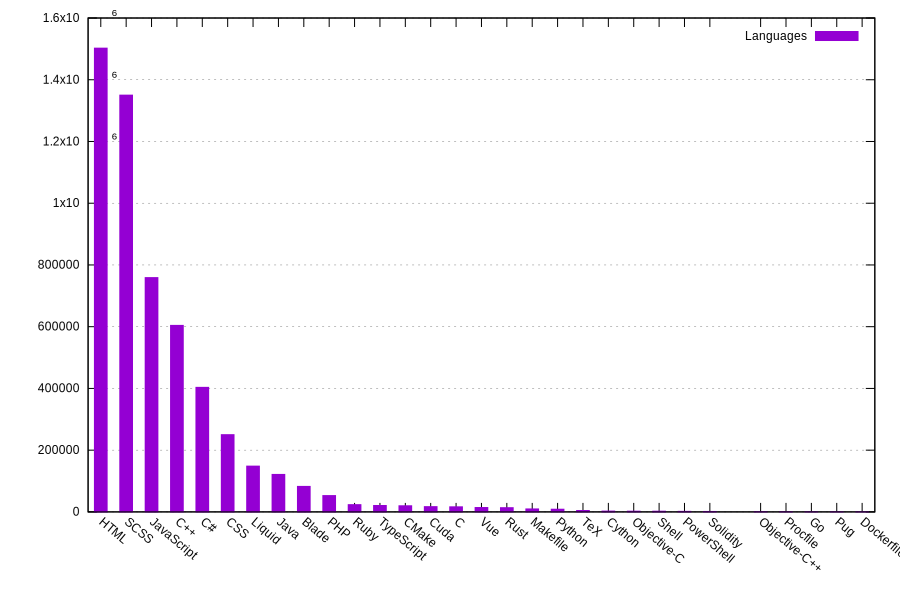

- 👋 Hi, I’m @DucMinhNgo, my blog is (https://ducminhngo.github.io/ngominhduc.github.io/).
- 👀 I’m interested in Go, Python, Javascript.
- 🌱 I’m currently learning Google Cloud Platform, Ensemble learning.

# GitHub Language Overview

## 🎨 Language Distribution (All Repositories)

---

## 📊 Language Table (All Repositories)

<!-- LANG-TABLE-START -->
| Language | Bytes |
|---------|-------|
| HTML | 1502336 |
| SCSS | 1350137 |
| JavaScript | 759013 |
| C++ | 604173 |
| C# | 403455 |
| CSS | 250204 |
| Liquid | 148290 |
| Java | 121378 |
| Blade | 82568 |
| PHP | 52838 |
| Ruby | 23445 |
| TypeScript | 20704 |
| CMake | 19829 |
| Cuda | 17006 |
| C | 16437 |
| Vue | 14145 |
| Rust | 13633 |
| Makefile | 9580 |
| Python | 8639 |
| TeX | 4551 |
| Cython | 2577 |
| Objective-C | 2287 |
| Shell | 2223 |
| PowerShell | 1751 |
| Solidity | 1404 |
| Jupyter Notebook | 865 |
| Objective-C++ | 746 |
| Procfile | 456 |
| Go | 290 |
| Pug | 275 |
| Dockerfile | 251 |
<!-- LANG-TABLE-END -->

  
  
  
  
  

